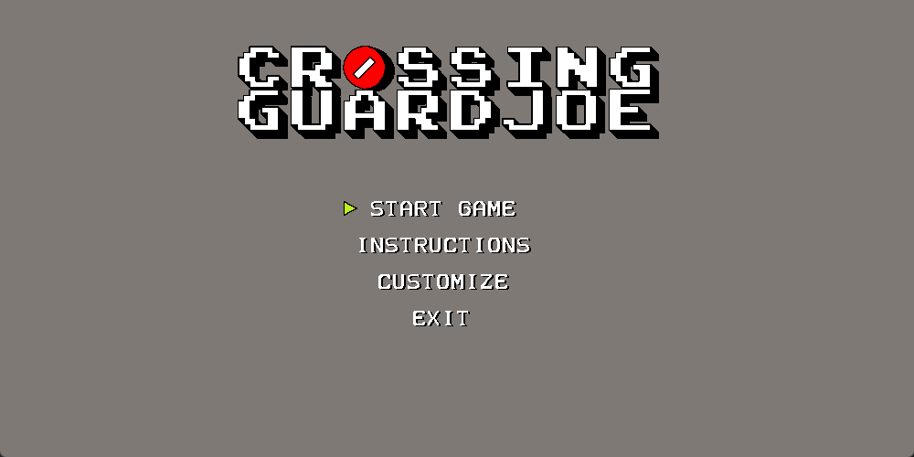
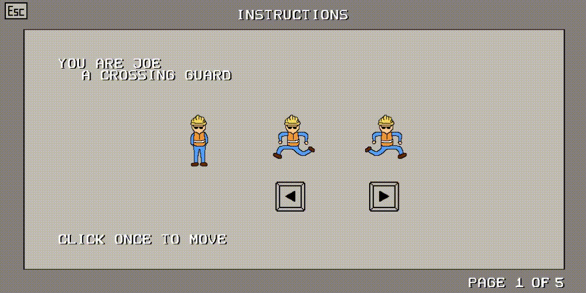
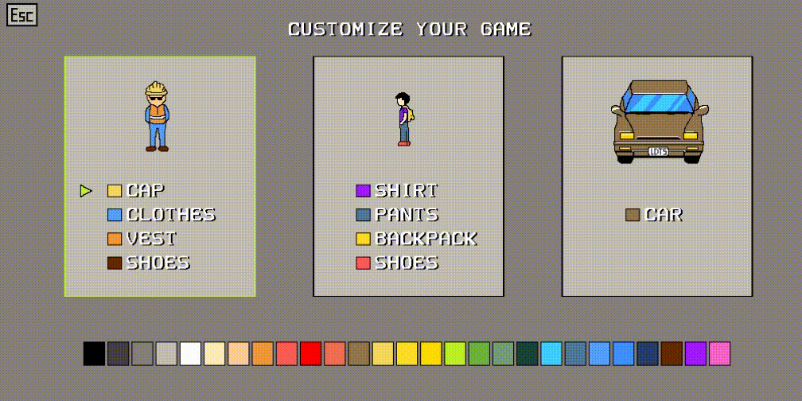

## LDTS_1105 - CrossingGuardJoe

> Get ready for the ultimate adrenaline rush in this action-packed arcade adventure as Crossing Guard Joe!  
> Brace yourself for the chaotic street where you'll battle unruly drivers.  
> This game demands lightning-fast reflexes and razor-sharp decision-making. The drivers show no mercy—they won't stop for anything, putting your quick thinking to the ultimate test as you navigate the kids to safety.  
> Your score? It's all about how many kids you guide across the street. Master each level, fine-tune your strategies, and dive into the customization options!
> You can personalize Crossing Guard Joe's outfit color, the kids' attire, and even the color of the cars. Express your style and make Joe stand out as you tackle the challenges of the busy streets.
> Ready to push your crossing guard skills to the limit?  
> Enter the game and show 'em who's the boss!

This project was developed by Bruno Huang (up202207517@fe.up.pt) and Ricardo Yang (up202208465@fe.up.pt) for LDTS 2023⁄24.

For a more detailed version of this description click [here](./docs/README.md).

## Screenshots

The following screenshots illustrate the general look of our game, as well as the divergent functionalities:

### Game preview

<b><i>Gif 1. Sneak peek into CrossingGuardJoe</i></b>
 
 

### Menus

<b><i>Fig 1. Main Menu</i></b>
 
 

<b><i>Gif 2. Instructions Menu</i></b>
 
 

<b><i>Gif 3. Customize Menu</i></b>
 
 