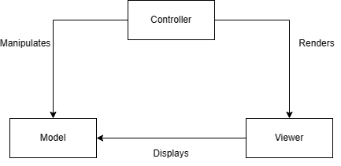
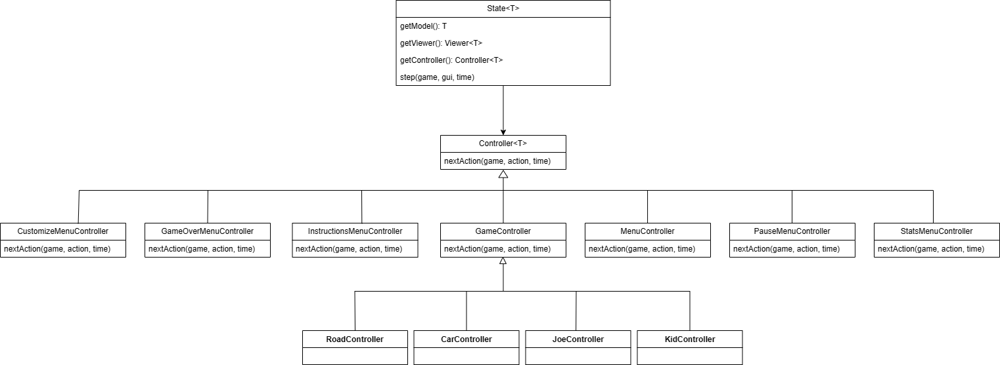
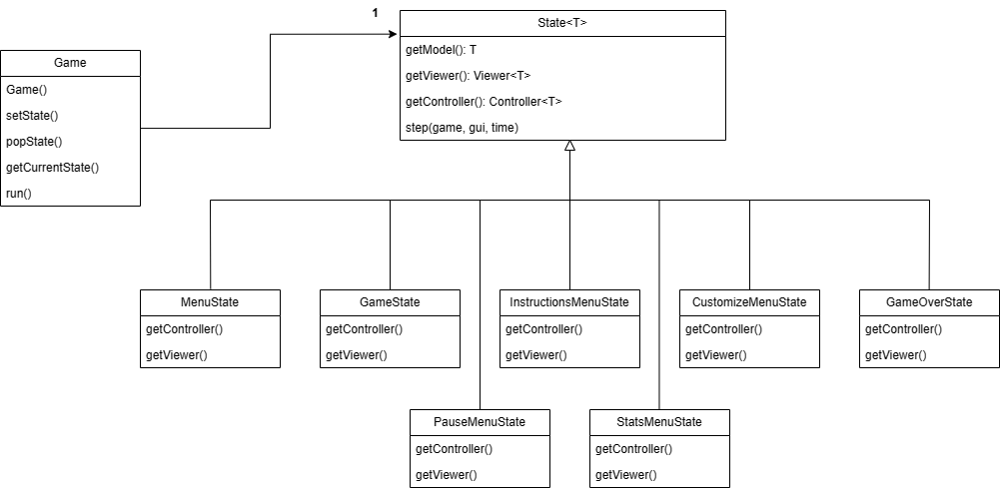
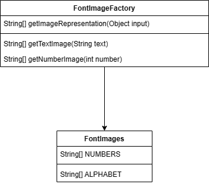
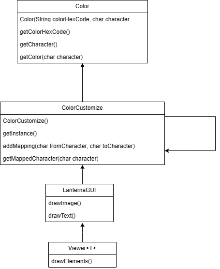
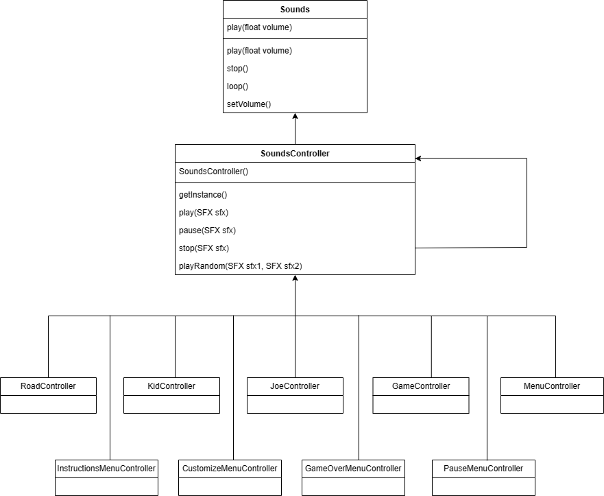

# LDTS_1105 - CrossingGuardJoe

## GAME DESCRIPTION
> Get ready for the ultimate adrenaline rush in this action-packed arcade adventure as Crossing Guard Joe!  
> Brace yourself for the chaotic street where you'll battle unruly drivers.  
> This game demands lightning-fast reflexes and razor-sharp decision-making. The drivers show no mercy—they won't stop for anything, putting your quick thinking to the ultimate test as you navigate the kids to safety.  
> Your score? It's all about how many kids you guide across the street. Master each level, fine-tune your strategies, and dive into the customization options!
> You can personalize Crossing Guard Joe's outfit color, the kids' attire, and even the color of the cars. Express your style and make Joe stand out as you tackle the challenges of the busy streets.
> Ready to push your crossing guard skills to the limit?  
> Enter the game and show 'em who's the boss!

This project was developed by Bruno Huang (up202207517@fe.up.pt) and Ricardo Yang (up202208465@fe.up.pt) for LDTS 2023⁄24.

## FEATURES

### IMPLEMENTED FEATURES

- **Menu** - Upon launching the application, a menu will be displayed presenting "START GAME", "INSTRUCTIONS", "CUSTOMIZE" and "EXIT".
- **Instructions** - 5 pages illustrated that show how you can play the game.
- **Customize** - Menu where user can change Joe's, kid's outfit color and car's color.
- **Exit** - Exit game.
- **Sound** - Plenty of SFX and BGM implemented in game.
- **Pause** - User can press 'ESC' mid-game to pause the game, then it's possible to resume, see game stats, or exit.
- **Stats** - User/player can see the current level, score and highest level, score.
- **Player movement** - The game character (Joe) is able to move left or right when corresponding arrow key is pressed.
- **Player control** - A kid will start to move when Joe is near it (an arrow will appear pointing to the kid) and presses 'arrowDown' key, or the kid will stop when 'arrowUp' key is pressed.
- **Player collision** - When Joe gets hit by a car, he is projected to either left or right side of the car.
- **Kid** - Kids are instantiated in a queue at the right sidewalk of the street, and they walk at a constant defined speed when Joe lets them walk.
- **Kid collision** - When a kid is hit, it goes with the car.
- **Car** - Cars are instantiated in a random road lane at the top side of the street, and they traverse the road in a unidirectional downward trajectory, the speed of a car is constant.
- **Score** - For every kid passing to the left sidewalk of the street player gets 100 points. If Joe gets hit by a car points are taken (quantity defined by hit spot);
- **Lives** - When a kid is hit by a car, player loses one hp. The amount of hp starts as 10.
- **Game over (Lose)** - When hp reaches 0 game ends.
- **Game over (Win)** - When level 9 is completed user wins the game.

### PLANNED FEATURES

- **NONE** - All features implemented.

## DESIGN

### UML

### CODE ORGANIZATION

**Problem in Context**

To enhance code readability and improve overall programming efficiency, we faced the task of drawing images and coding their movements. Consequently, a need arose to compartmentalize these tasks for better organization and clarity in the codebase.

**The Pattern**

We have applied the **MVC** pattern. To enhance readability and improve programming efficiency

**Implementation**

We organized the code into three distinct sections:
- Model: Manages data related to image properties and movements.
- View: Handles the drawing of images on the screen.
- Controller: Manages user input and orchestrates the interaction between the Model and View for smooth image rendering and movement.

These directories can be found below:

- [Model](../src/main/java/com/CrossingGuardJoe/model)
- [View](../src/main/java/com/CrossingGuardJoe/viewer)
- [Controller](../src/main/java/com/CrossingGuardJoe/controller)

**Consequences**

The use of the MVC architectural pattern in the current design allows the following benefits:

- promotes a clear separation of concerns, allowing for modular development. The model, view, and controller components can be developed and modified independently, making the codebase more maintainable.
- increased code reusability. Models and views can be reused across different parts of the application, reducing redundancy.
- the separation of concerns makes it easier to test individual components.

### KEY INPUTS

**Problem in Context**

To make elements move and change the animations according to user inputs, we had the need to read the key and make actions according to it.

**The Pattern**

We have applied the **Observer** pattern. So elements could "know" what action to do next.

**Implementation**

We implemented **nextAction** method in Controller class so when GUI class gets next action we could update the control of the elements and also
the view immediately after.

These classes can be found below:

- [Controller](../src/main/java/com/CrossingGuardJoe/controller/Controller.java)
- [CustomizeMenuController](../src/main/java/com/CrossingGuardJoe/controller/menu/CustomizeMenuController.java)
- [GameOverMenuController](../src/main/java/com/CrossingGuardJoe/controller/menu/GameOverMenuController.java)
- [InstructionsMenuController](../src/main/java/com/CrossingGuardJoe/controller/menu/InstructionsMenuController.java)
- [MenuController](../src/main/java/com/CrossingGuardJoe/controller/menu/MenuController.java)
- [PauseMenuController](../src/main/java/com/CrossingGuardJoe/controller/menu/PauseMenuController.java)
- [StatsMenuController](../src/main/java/com/CrossingGuardJoe/controller/menu/StatsMenuController.java)
- [GameController](../src/main/java/com/CrossingGuardJoe/controller/game/GameController.java)
- [RoadController](../src/main/java/com/CrossingGuardJoe/controller/game/RoadController.java)
- [CarController](../src/main/java/com/CrossingGuardJoe/controller/game/elements/CarController.java)
- [JoeController](../src/main/java/com/CrossingGuardJoe/controller/game/elements/JoeController.java)
- [KidController](../src/main/java/com/CrossingGuardJoe/controller/game/elements/KidController.java)

**Consequences**

This implementation provided distributed event handling and reduced coupling between components.

### DIFFERENT GAME STATES

**Problem in Context**

When writing the code we realised that we need something to distinguish in game state from menu state (for example).

**The Pattern**

We have applied the **State** pattern. This allows the program to alter its behavior when its internal state changes.

**Implementation**

We implemented the State abstract class that has the methods "getController()" and "getViewer()" and also implemented a state stack
to be able to pause the game, we only need to pop the pause state when we resume the game. The states are controlled in Game class 
by the method "step()".

These classes can be found below:

- [State](../src/main/java/com/CrossingGuardJoe/states/State.java)
- [Game](../src/main/java/com/CrossingGuardJoe/Game.java)
- [MenuState](../src/main/java/com/CrossingGuardJoe/states/menu/MenuState.java)
- [GameState](../src/main/java/com/CrossingGuardJoe/states/GameState.java)
- [InstructionsMenuState](../src/main/java/com/CrossingGuardJoe/states/menu/InstructionsMenuState.java)
- [CustomizeMenuState](../src/main/java/com/CrossingGuardJoe/states/menu/CustomizeMenuState.java)
- [GameOverState](../src/main/java/com/CrossingGuardJoe/states/menu/GameOverState.java)
- [PauseMenuState](../src/main/java/com/CrossingGuardJoe/states/menu/PauseMenuState.java)
- [StatsMenuState](../src/main/java/com/CrossingGuardJoe/states/menu/StatsMenuState.java)

**Consequences**

The implementation of this pattern promotes cleaner code by encapsulating the state-specific behavior in separate classes.
It showed particularly useful because game's behavior depends on its state and transitions between states.

### IMAGE FONT DEFINITION

**Problem in Context**

We realised that we had the need to make it easier to distinguish the number images from letter images, 
because the whole font was drawn by ourselves so the code wouldn't be able to know when to get 
number images nor when to get letter images.

**The Pattern**

We have applied the **Factory** pattern. This allowed the user to be able to "draw" the respective "string image" or "int image" 
without the need to alter a type nor code.

**Implementation**

We implemented methods to "create images" based on user input, if user input is an integer it can automatically create a number image
predefined in another class, the same happens to a string input.

These classes can be found below:

- [FontImageFactory](../src/main/java/com/CrossingGuardJoe/viewer/images/Font/FontImageFactory.java)
- [FontImages](../src/main/java/com/CrossingGuardJoe/viewer/images/Font/FontImages.java)

**Consequences**

With this pattern the code only needs to deal with the input of the user, and is shielded from the details of object creation, 
allowing for flexibility and loose coupling between the client and the created objects.

### COLOR MATCH

**Problem in Context**

When drawing the images we thought that with a certain color matching to a certain character would facilitate our coding and readability of the images.

**The Pattern**

We have applied the **Singleton** pattern. This allowed us to be able to use getInstance() method and make use of a single instance of character (color) through the
entire code, for e.g. '$' matches color black (#000000), whenever we needed to use a color, we could simply get it from the "map of colors" that we created.

**Implementation**

With ColorCustomize class, every viewer class could make use of the same single object of color.

These classes can be found below:

- [Color](../src/main/java/com/CrossingGuardJoe/viewer/Color.java)
- [ColorCustomize](../src/main/java/com/CrossingGuardJoe/viewer/ColorCustomize.java)
- [LanternaGUI](../src/main/java/com/CrossingGuardJoe/gui/LanternaGUI.java)
- [Viewer](../src/main/java/com/CrossingGuardJoe/viewer/Viewer.java)

**Consequences**

With this pattern, we made the code more maintainable and readable without the need to create an instance of color every single time we used it in a different class.

### SOUND PROBLEMS

**Problem in Context**

When implementing a background music to the game we realised that we had the need to control the same sound from different classes
(to start and to stop).

**The Pattern**

We have applied the **Singleton** pattern. This allowed the different classes to manipulate the same instance of sound.

**Implementation**

We implemented the SoundsController class with a method getInstance() so we didn't need anymore to create a Sound object 
in each class and not be able to pause/stop a sound instantiated in another class.

These classes can be found below:

- [Sounds](../src/main/java/com/CrossingGuardJoe/controller/Sounds.java)
- [SoundsController](../src/main/java/com/CrossingGuardJoe/controller/SoundsController.java)
- [RoadController](../src/main/java/com/CrossingGuardJoe/controller/game/RoadController.java)
- [GameController](../src/main/java/com/CrossingGuardJoe/controller/game/GameController.java)
- [KidController](../src/main/java/com/CrossingGuardJoe/controller/game/elements/KidController.java)
- [JoeController](../src/main/java/com/CrossingGuardJoe/controller/game/elements/JoeController.java)
- [InstructionsMenuController](../src/main/java/com/CrossingGuardJoe/controller/menu/InstructionsMenuController.java)
- [CustomizeMenuController](../src/main/java/com/CrossingGuardJoe/controller/menu/CustomizeMenuController.java)
- [GameOverMenuController](../src/main/java/com/CrossingGuardJoe/controller/menu/GameOverMenuController.java)
- [PauseMenuController](../src/main/java/com/CrossingGuardJoe/controller/menu/PauseMenuController.java)

**Consequences**

This pattern made the code able to manage the same instance every time and not create a copy of it. 
This helped us to stop/pause some sounds from different classes from the one it was instantiated.

## KNOWN CODE SMELLS

> 1. In 'Menu Viewer' classes we have repeated blocks of code to draw a certain repeated image for each class that uses it.
> 2. Some classes are too tightly coupled, maybe we could reduce dependencies and use proper encapsulation to make classes more independent.
> 3. In viewer classes we use magic numbers without explanation to position the images on screen.

## ERROR-PRONE WARNINGS

> src\main\java\com\CrossingGuardJoe\Game.java:22:
[JdkObsolete] Stack is a nonstandard class that predates the Java Collections Framework; prefer ArrayDeque. Note that the Stack methods push/pop/peek correspond to the Deque methods addFirst/removeFirst/peekFirst.
stateStack = new Stack<>();

> For [JdkObsolete] warnings, we didn't change to ArrayDequeue because after putting states in ArrayDequeue we faced the problem of nullpointer when exiting the game, and since we didn't learn about this data structure we didn't know how to fix it,
and we were afraid of further problems given by it.

## TESTING

> We didn't test 2 lanterna methods that would open a terminal and methods related to Game class because they would need an instance of Game.

> There were three classes that we didn't mutate (Sounds, SoundsController, Game) because we found it really hard to make tests
> for the sounds to kill the mutations, and we were sure that the sounds were working well, also the Game class because it's the class
> that has the run() method and initiates the game.

> Also in the 28% of mutation coverage, some were the sound instances that were inserted through the code that we couldn't make it to
> not mutate, some were codes related to the positioning of the images and the movement of the characters (e.g. 'Kids' only walk to left
> so the update of position would be 'position - x' from a call to a method 'MoveKid()', but the mutation would turn **-** to **+**, also the 
> positioning of images, because our game uses large images, we had the need to draw in a specified position and the pit test would mutate
> the value of that position), other mutations were related with methods and lines of code that would update with the running of the game
> and so we couldn't write tests to kill the mutations in those parts.

### Link to mutation testing report
- [Pit Test Coverage Report](pitest/index.html)

## SELF-EVALUATION

- Bruno Huang: 50%
- Ricardo Yang: 50%
