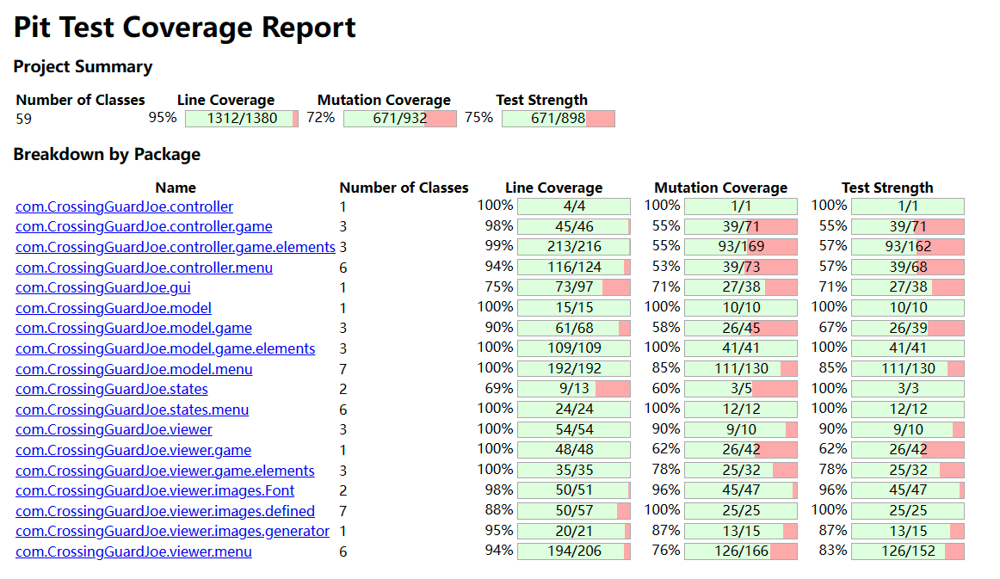

## LDTS_1105 - CrossingGuardJoe

> Get ready for the ultimate adrenaline rush in this action-packed arcade adventure as Crossing Guard Joe!  
> Brace yourself for the chaotic street where you'll battle unruly drivers.  
> This game demands lightning-fast reflexes and razor-sharp decision-making. The drivers show no mercy—they won't stop for anything, putting your quick thinking to the ultimate test as you navigate the kids to safety.  
> Your score? It's all about how many kids you guide across the street. Master each level, fine-tune your strategies, and dive into the customization options!
> You can personalize Crossing Guard Joe's outfit color, the kids' attire, and even the color of the cars. Express your style and make Joe stand out as you tackle the challenges of the busy streets.
> Ready to push your crossing guard skills to the limit?  
> Enter the game and show 'em who's the boss!

This project was developed by Bruno Huang (up202207517@fe.up.pt) and Ricardo Yang (up202208465@fe.up.pt) for LDTS 2023⁄24.

### IMPLEMENTED FEATURES

- **Menu** - Upon launching the application, a menu will be displayed presenting "START GAME", "INSTRUCTIONS", "CUSTOMIZE" and "EXIT".
- **Instructions** - 5 pages illustrated that show how you can play the game.
- **Customize** - Menu where user can change Joe's, kid's outfit color or car's color.
- **Exit** - Exit game.
- **Sound** - Plenty of SFX and BGM implemented in game.
- **Pause** - User can press 'ESC' mid-game to pause the game, then it's possible to resume, see stats, or exit.
- **Stats** - User/player can see the current level, score and highest level, score.
- **Player movement** - The game character (Joe) is able to move left or right when corresponding arrow key is pressed.
- **Player control** - A kid will start to move when Joe is near it (an arrow will appear pointing to the kid) and presses 'arrowDown' key, when 'arrowUp' key is pressed the kid stops moving.
- **Player collision** - When Joe gets hit by a car, he is projected to either left or right side of the car.
- **Kid** - Kids are instantiated in a queue at the right sidewalk of the street, and they walk at a constant defined speed when Joe lets them walk.
- **Kid collision** - When a kid is hit, it goes with the car.
- **Car** - Cars are instantiated in a random road lane at the top side of the street, and they traverse the road in a unidirectional downward trajectory, the speed of a car is constant.
- **Score** - For every kid passing to the left sidewalk of the street player gets 100 points. If Joe gets hit by a car points are taken (quantity defined by hit spot);
- **Lives** - When a kid is hit by a car, player loses one hp. The amount of hp starts as 10.
- **Game over (Lose)** - When hp reaches 0 game ends.
- **Game over (Win)** - When level 9 is completed user wins the game.

### PLANNED FEATURES

- **NONE** - All features implemented.

### DESIGN

**UML**

#### CODE ORGANIZATION

**Problem in Context**

To enhance code readability and improve overall programming efficiency, we faced the task of drawing images and coding their movements. Consequently, a need arose to compartmentalize these tasks for better organization and clarity in the codebase.

**The Pattern**

We have applied the **MVC** pattern. To enhance readability and improve programming efficiency

**Implementation**

We organized the code into three distinct sections:

Model: Manages data related to image properties and movements.

View: Handles the drawing of images on the screen.

Controller: Manages user input and orchestrates the interaction between the Model and View for smooth image rendering and movement.

These classes can be found below:

- [Model](https://github.com/FEUP-LDTS-2023/project-l11gr05/tree/master/src/main/java/com/aor/CrossingGuardJoe/model)
- [View](https://github.com/FEUP-LDTS-2023/project-l11gr05/tree/master/src/main/java/com/aor/CrossingGuardJoe/view)
- [Controller](https://github.com/FEUP-LDTS-2023/project-l11gr05/tree/master/src/main/java/com/aor/CrossingGuardJoe/controller)

**Consequences**

The use of the MVC architectural pattern in the current design allows the following benefits:

- promotes a clear separation of concerns, allowing for modular development. The model, view, and controller components can be developed and modified independently, making the codebase more maintainable.
- increased code reusability. Models and views can be reused across different parts of the application, reducing redundancy.
- the separation of concerns makes it easier to test individual components.

#### Key inputs

**Problem in Context**

To make elements move and change the animations according to user inputs, we had the need to read the key and make actions according to it.

**The Pattern**

We have applied the **Observer** pattern. So elements could "know" what action to do next.

**Implementation**

We implemented **nextAction** method in Controller class so when GUI class gets next action we could update the control of the elements and also
the view immediately after.

These classes can be found below:

- [Controller](../src/main/java/com/CrossingGuardJoe/controller/Controller.java)
- [CustomizeMenuController](../src/main/java/com/CrossingGuardJoe/controller/menu/CustomizeMenuController.java)
- [GameOverMenuController](../src/main/java/com/CrossingGuardJoe/controller/menu/GameOverMenuController.java)
- [InstructionsMenuController](../src/main/java/com/CrossingGuardJoe/controller/menu/InstructionsMenuController.java)
- [MenuController](../src/main/java/com/CrossingGuardJoe/controller/menu/MenuController.java)
- [PauseMenuController](../src/main/java/com/CrossingGuardJoe/controller/menu/PauseMenuController.java)
- [StatsMenuController](../src/main/java/com/CrossingGuardJoe/controller/menu/StatsMenuController.java)
- [GameController](../src/main/java/com/CrossingGuardJoe/controller/game/GameController.java)
- [RoadController](../src/main/java/com/CrossingGuardJoe/controller/game/RoadController.java)
- [CarController](../src/main/java/com/CrossingGuardJoe/controller/game/elements/CarController.java)
- [JoeController](../src/main/java/com/CrossingGuardJoe/controller/game/elements/JoeController.java)
- [KidController](../src/main/java/com/CrossingGuardJoe/controller/game/elements/KidController.java)

**Consequences**

This implementation provided distributed event handling and reduced coupling between components.

#### KNOWN CODE SMELLS

> 1. In 'Menu Viewer' classes we have repeated blocks of code to draw a certain repeated image for each class that uses it.
> 2. Some classes are too tightly coupled, maybe we could reduce dependencies and use proper encapsulation to make classes more independent.
> 3. In viewer classes we use magic numbers without explanation to position the images on screen.

### TESTING

> There were three classes that we didn't mutate (Sounds, SoundsController, Game) because we found it really hard to make tests
> for the sounds to kill the mutations, and we were sure that the sounds were working well, also the Game class because it's the class
> that has the run() method and initiates the game.
> 
> Also in the 29% of mutation coverage, some were the sound instances that were inserted through the code that we couldn't make it to
> not mutate, some were codes related to the positioning of the images and the movement of the characters (e.g. 'Kids' only walk to left
> so the update of position would be 'position - x' from a call to a method 'MoveKid()', but the mutation would turn '-' to '+', also the 
> positioning of images, because our game uses large images, we had the need to draw in a specified position and the pit test would mutate
> the value of that position), other mutations were related with methods and lines of code that would update with the running of the game
> and so we couldn't write tests to kill the mutations in those parts.

### Link to mutation testing report
- [Pit Test Coverage Report](pitest/index.html)

### SELF-EVALUATION

- Bruno Huang: 50%
- Ricardo Yang: 50%
